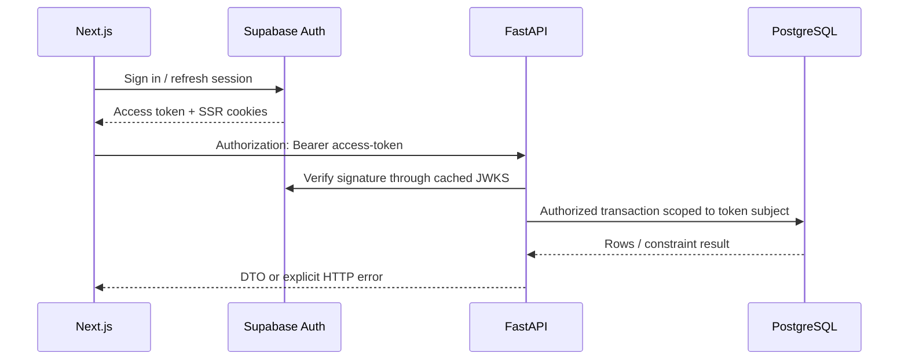

# Backend architecture

## Responsibilities

FastAPI is the only business-command API. It validates request bodies, verifies Supabase JWTs, checks the persisted profile role/status, performs transactions, and returns minimal DTOs. The frontend may access Supabase directly only for Auth, Realtime subscriptions, and RLS-protected avatar uploads.

## Code organization

- `main.py`: application construction, CORS, request IDs, health checks, and router registration.
- `config.py`: environment validation.
- `auth.py`: Bearer token/JWKS verification and trusted admin claim handling.
- `db.py`: async SQLAlchemy engine and request-scoped sessions.
- `models.py` and `schemas.py`: PostgreSQL mappings and public request/response contracts.
- `routers/`: thin account, mentor, booking, community, and platform domain endpoints.
- `domain.py`: the booking state-transition invariant shared by commands and tests.

There is intentionally no repository-interface layer, service factory, application event bus, Redis cache, or background-job system. Add one only when a measured requirement cannot be handled by PostgreSQL, FastAPI, or a selected provider.

## Trust boundaries

- Browser input is untrusted and validated by Pydantic and database constraints.
- FastAPI verifies JWT signature, issuer, audience, expiry, issued-at, and subject.
- `user_metadata` is never used for authorization. Initial signup metadata is sanitized by a private trigger; mentor accounts always start pending and admin authority comes only from trusted `app_metadata`.
- Database/service credentials never enter `NEXT_PUBLIC_*` variables.
- CORS uses explicit origins. Production must not use `*` with credentials.
- Payment and hosted-meeting success is impossible until a configured provider confirms it.

## Health and observability

- `/health/live`: process liveness without external dependencies.
- `/health/ready`: checks PostgreSQL connectivity and returns `503` when unavailable.
- Every response receives `X-Request-ID`, preserving an incoming ID when supplied.
- FastAPI validation errors remain standard structured `422` responses; authorization failures use `401` or `403`; invalid state changes use `409`.
