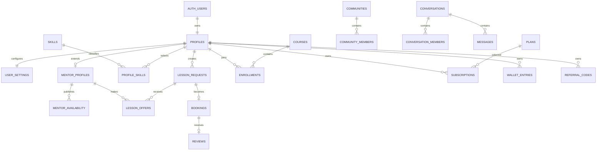

# Database and security model

The authoritative migration is under `backend/supabase/migrations/`. PostgreSQL stores UUID identifiers, UTC `timestamptz` timestamps, integer minor-unit money values, and explicit three-character currencies.

## Core ERD

## Integrity rules

- Roles are `student` or `mentor`; mentor approval is `pending`, `approved`, or `rejected`.
- Approved mentors alone are public and eligible to offer lessons.
- Requested and booked intervals require start before end.
- PostgreSQL exclusion constraints prevent overlapping confirmed/in-progress bookings for either participant.
- One request produces at most one booking, one accepted offer belongs to at most one booking, and one completed booking receives at most one review.
- Money is non-negative except immutable wallet/reputation ledger deltas, which must be non-zero.
- Payment orders target exactly one booking or subscription.
- Provider event IDs and idempotency keys are unique.

## Index strategy

- Every ownership/RLS column used in frequent predicates is indexed.
- Partial indexes cover approved mentors, active availability, unread notifications, and common status queues.
- Messages use `(conversation_id, created_at desc, id desc)` for cursor pagination.
- Booking, offer, request, payment, wallet, reputation, and enrollment indexes follow their role-specific list filters.

Indexes should be retained or removed based on query plans and production statistics, not speculation.

## Row-Level Security

RLS is enabled on every table in `public`. Data API privileges are revoked by default and explicitly granted only for required reads.

- Users can read their own private profile, settings, enrollments, subscriptions, invoices, referrals, wallet, reputation, and notifications.
- Booking parties can read their requests, offers, bookings, and resources.
- Conversation members can read only conversations and messages they belong to.
- Anonymous access is limited to active skills, approved mentor data, published courses, active communities, plans, and public reviews.
- Policies target `anon`/`authenticated` explicitly and use `(select auth.uid())` on indexed ownership columns.
- All business writes go through FastAPI; no broad authenticated insert/update/delete grants exist.

The `private` schema contains idempotency, integration, and audit records and is unavailable to Data API roles.

## Auth bootstrap

`private.handle_new_auth_user()` is a trigger-only `security definer` function with an empty search path and no execution grant for public API roles. It copies sanitized signup data into `profiles`, creates default settings, starts mentors in `pending`, and links a known skill slug. It never copies or derives administrator authority from user-editable metadata.

## Storage and Realtime

- `avatars`: public reads; authenticated owners write only below their user-ID folder.
- `mentor-documents`: private; server/admin access only.
- `lesson-resources`: private; server-mediated access for booking parties.
- `messages` is added to `supabase_realtime`; message reads remain protected by conversation membership RLS.
