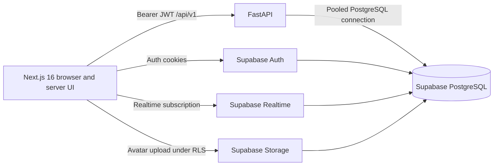

# Upskillink project overview

## System map

The frontend owns presentation and session-aware navigation. Supabase Auth owns identities and refresh-token rotation. FastAPI validates Supabase access tokens and owns business validation, authorization, state transitions, and transactions. PostgreSQL constraints and RLS provide the final data-integrity and direct-channel security boundaries.

## Repository layout

| Path | Responsibility |
| --- | --- |
| `frontend/` | Next.js App Router application and Figma-derived UI |
| `backend/app/` | FastAPI application, authentication, models, schemas, and domain routers |
| `backend/supabase/` | Supabase configuration and the authoritative SQL migration history |
| `backend/tests/` | Backend unit and API-boundary tests |
| `backend/docs/` | Architecture, schema, API, security, and operations documentation |
| `frontend/docs/` | Frontend architecture, route, design-system, and integration documentation |

## Implemented domains

- Supabase email/password authentication, email confirmation, SSR cookies, route protection, and logout.
- Student and mentor profiles, skills, settings, mentor approval, discovery, and availability.
- Lesson requests, mentor offers/counter-offers, idempotent acceptance, bookings, schedules, and verified reviews.
- Course catalogue and enrollments.
- Communities, direct/community conversations, persisted messages, and Realtime publication.
- Plans, pending subscriptions, referrals, wallet/reputation ledgers, notifications, and dashboards.
- Explicit integration boundaries for payments and hosted video. These return `503` until a provider is configured.

## Documentation index

- [Backend documentation](../backend/docs/README.md)
- [Frontend documentation](../frontend/docs/README.md)
- [Database and RLS](../backend/docs/DATABASE.md)
- [API contracts](../backend/docs/API.md)
- [Operations](../backend/docs/OPERATIONS.md)
